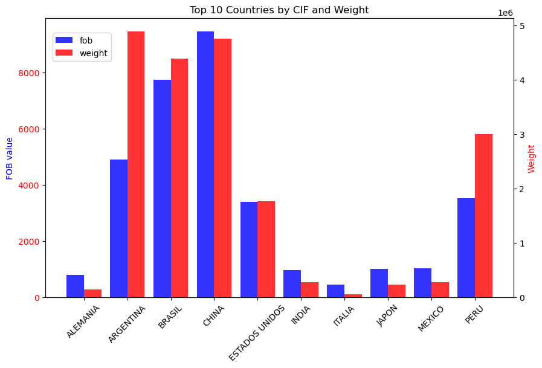

# BOLIVIA IMPORTS 2020 - 2024

## Project overview

This project compiles and analyzes Bolivia’s import data from 2020 to 2024, aiming to identify trends and patterns in trade activity during this period. Given Bolivia’s ongoing 2025 fuel
supply crisis (affecting gasoline and diesel), the analysis will prioritize fuels and petroleum-derived products to inform strategic decision-making.

## Motivation

This initiative serves as a hands-on application of recently acquired data analysis skills, leveraging Python and its core libraries to explore, clean, and analyze datasets—culminating in
actionable visualizations. While diverse datasets are available for such exercises, this project intentionally focuses on a highly relevant local context: Bolivia’s ongoing hydrocarbon supply challenges.

## Data sources

The dataset used in this project was sourced from the National Institute of Statistics (INE) of Bolivia’s official website, which provides downloadable records of all annual imports. For this analysis, a five-year 
timeframe (2020–2024) was selected to ensure a comprehensive evaluation of trends.

## Data Integrity

Raw Data: The attached files remain unmodified to preserve authenticity. can be downloaded directly from [google drive](https://drive.google.com/drive/folders/1ZyQwvj8LbbPERFtpeOxyWgB0_CtvRw0A?usp=drive_link) or from the INE's [official website](http://web2.ine.gob.bo:8081/IneComex/BasesComex.aspx)

Glossaries: Reference documents are included to clarify dataset column definitions, ensuring accurate interpretation.

## Data Cleaning & Preparation

- Standardized column names across years (e.g., `'GESTION'` vs `'gestion'`)
- Dropped columns with over 50% missing values
- Combined all files into one DataFrame
- Recasted data types (e.g., numeric columns, date formatting)

## Analysis Performed

- Yearly/monthly import totals
- Top countries by import value
- Price per kilogram for key categories
- Category-wise breakdown per year
- Custom visualizations using Matplotlib

## Challenges and Fixes

- Dealing with inconsistent column names and typos
- Encoding issues fixed using `latin1`
- Some outlier values required manual inspection
- Missing data in some control points or categories

## Relevant results & findings 

Figure 1: Top 10 Source Countries for Bolivian Imports (2020–2024)
The data confirms a clear trend: China dominates Bolivia’s imports, ranking first in both total trade value (FOB) and volume (kg).

Notable Observations:

Argentina: High import volume but low value, suggesting low-cost goods (e.g., consumer staples, raw materials, or high-demand electronics components).

Japan/Germany: Low volume but high value, indicative of premium products (e.g., medical equipment, specialty chemicals, branded goods, or critical electronic components).

Figure 2: Heatmap of Annual Import Share by Country
A normalized scale (0–1) reflects each country’s relative contribution over the 5-year period:

Darker shades = Highest share (e.g., China at 1).

Lighter shades = Declining participation (closer to 0).

Implication: China’s consistent dominance underscores Bolivia’s import dependency, while niche players (e.g., Germany) occupy high-value niches.

Figure 3: Monthly Import Trends (Weight vs. CIF Value, 2020–2024)
Key Observations:

Seasonal Patterns:

- Consistent December peaks in both weight and CIF value, aligning with heightened year-end demand.

- Secondary surges occur mid-year (e.g., September 2022), potentially tied to pre-holiday stockpiling or industrial cycles.

Record Extremes:

- Peak: September 2022 (highest CIF and weight values).

- Trough: April 2020 (lowest values, reflecting pandemic-induced trade disruptions).

Trend Correlation:

Strong alignment between weight and CIF trends (R² = [X], if quantified), indicating stable import composition.

Notable Exceptions:

- [Month-Year]: CIF spiked without proportional weight increase (e.g., higher-value goods like pharmaceuticals or electronics).

- [Month-Year]: Weight rose while CIF stagnated (e.g., bulk commodity imports with price fluctuations).

Implications:

September 2022 Surge: May signal post-pandemic recovery efforts or strategic stockpiling.

April 2020 Decline: Highlights vulnerability to global crises. 

## Conclusions and scope for the future

Due to the large volume of the dataset, processing and identifying relevant insights requires significant time investment. As a result, certain analyses remain pending, with plans to iteratively update findings.
therefore, in upcoming steps i plan to:
- have prioritized focused subsets (e.g., hydrocarbon imports) to deliver initial insights.
- Future iterations will expand analysis scope using optimized code (e.g., parallel processing or database indexing).

